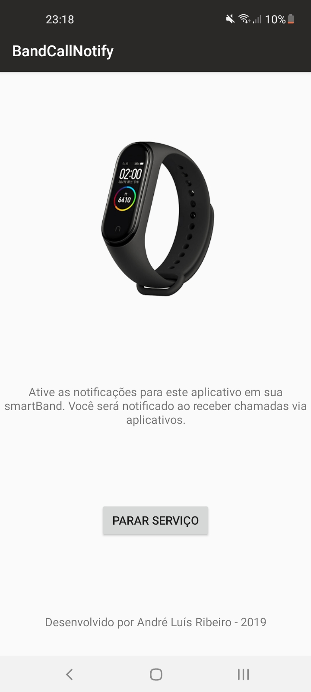
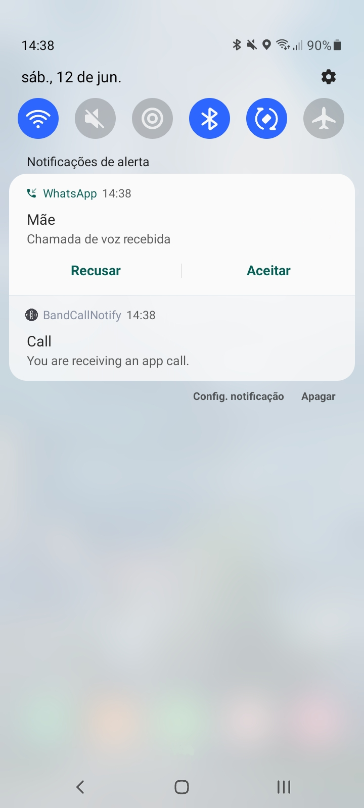

# BandCall
Enable notifications in smartbands for calls from Whatsapp, Teams, Skype, and other apps, without getting notified for every message in those apps. Developed natively in Android.

## Presentation
One of the main benefits of using a smartband is receiving notifications right away through vibration. In most smartband models, for that, you must enable the notifications for specific apps in the band app. For Whatsapp, for example, that means receiving notifications both for messages and calls. That is, in order to receive notifications for a few important calls, you must enable notifications for every tiny message you might get on Whatsapp. This app creates a bridge for receiving notifications only for calls from Whatsapp and other communication apps, making sure you get notified by any urgent call but not by an enormous amount of text-messages.

## Features
* Tested for Whatsapp, Teams, and Skype;
* Auto-start the service with the smartphone;
* Vibrates through all the call interval, from 5 to 5 seconds until dismiss or answer;
* Stop vibrating when the notification is dismissed.

  
  

## How does it work
This app keeps running in backend, verifying the sound mode of the Android system. When the sound mode changes to the call mode, the app creates a notification in the phone that will be sent to the smartband. In a nutshell, it works by identifying calls and sending notifications to the smartband. For that, **you must enable notifications for this app in your smartband app**.

## Compatibility
* Tested in miBand 2, 3, and 4.
* Tested in Android 7 and 10.
